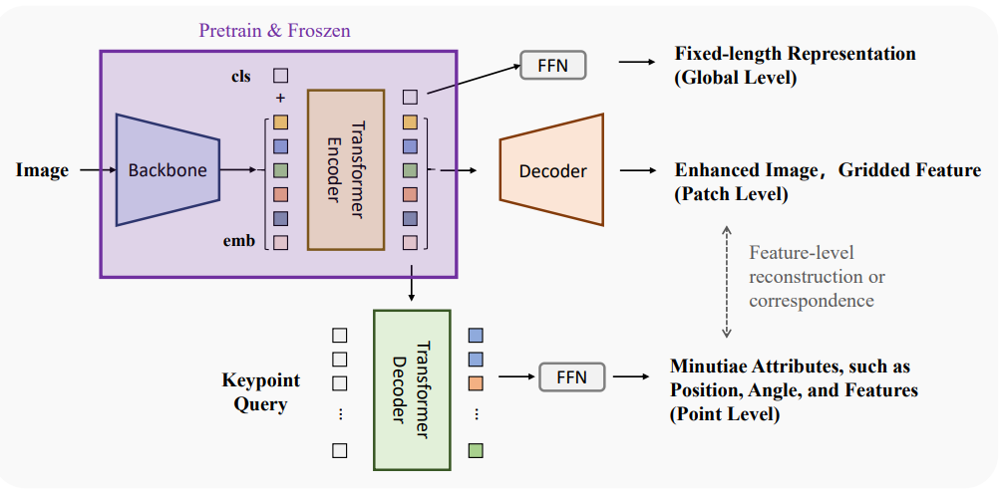

<!--
 * @Description: 
 * @Author: Xiongjun Guan
 * @Date: 2026-06-17 10:19:41
 * @version: 0.0.1
 * @LastEditors: Xiongjun Guan
 * @LastEditTime: 2026-06-17 10:34:30
 * 
 * Copyright (C) 2026 by Xiongjun Guan, Tsinghua University. All rights reserved.
-->
# UoU

<h5 align="left"> If our project helps you, please give us a star ⭐ on GitHub to support us. 🙏🙏 </h2>

<br>

 


### :speech_balloon: This repository is a partial code release related to:

- **_Arxiv 2026_**: **UoU: A Universal Fingerprint Foundation Model Based on Large-Scale Unsupervised Learning**
  
<a href="https://arxiv.org/pdf/2606.17436" style="text-decoration: none;"></a>

[Xiongjun Guan](https://xiongjunguan.github.io/), Jianjiang Feng, Jie Zhou

---

## :art: Introduction

<p align="center">
  
</p>


The repository in `../code` currently centers on a fingerprint keypoint extraction baseline built with a DETR-style architecture:

- backbone: ResNet18 or ResNet34
- encoder-decoder: Transformer
- targets: `core`, `delta`, and `minutiae`
- learning paradigm: set prediction with Hungarian matching


1. `Current baseline`
   A transformer-based unified keypoint extractor for fingerprint core, delta, and minutiae prediction.

2. `Long-term direction`
   A vertical foundation model for fingerprint intelligence, where a shared backbone is pretrained at scale and then post-trained or fine-tuned for downstream tasks such as enhancement, alignment, matching, identification, and anti-spoofing.


## :pushpin: What Is Already Implemented

- image and annotation loading for fingerprint samples
- keypoint normalization and augmentation
- a transformer-based prediction model
- matching and criterion scaffolding for set prediction
- training script and config structure
- planning figures for future framework design

## :pushpin: What Looks Like Baseline or Work-in-Progress

- external absolute paths are hard-coded in configs and data preparation scripts
- some loss wiring appears incomplete in the current snapshot
- argument parsing and training code are not fully aligned
- dataset packaging and reproducible instructions are not yet ready for public release


## :file_folder: Key Files

- `../code/train.py`: training entry point
- `../code/models/DETR.py`: main baseline model
- `../code/data_loader.py`: training data pipeline and augmentation
- `../code/losses/matcher.py`: Hungarian matcher
- `../code/configs/config.yaml`: baseline training configuration
- `../images/flowchart.pdf`: overall framework diagram
- `../images/token.pdf`: tokenization and representation planning
- `../images/train.pdf`: training roadmap planning
- `../part.txt`: long-form future work notes
- `../plan.pptx`: planning slides

<br>

## :bookmark_tabs: Citation

If you find this repository useful, please give us stars and use the following BibTeX entry for citation.


```text
@misc{guan2026uouuniversalfingerprintfoundation,
      title={UoU: A Universal Fingerprint Foundation Model Based on Large-Scale Unsupervised Learning}, 
      author={Xiongjun Guan and Jianjiang Feng and Jie Zhou},
      year={2026},
      eprint={2606.17436},
      archivePrefix={arXiv},
      primaryClass={cs.CV},
      url={https://arxiv.org/abs/2606.17436}, 
}
```


<br>

## :triangular_flag_on_post: License

This project is released under the MIT license. Please see the LICENSE file for more information.

<br>

---

## :mailbox: Contact Me

If you have any questions about the code, please contact:
Xiongjun Guan gxj21@mails.tsinghua.edu.cn